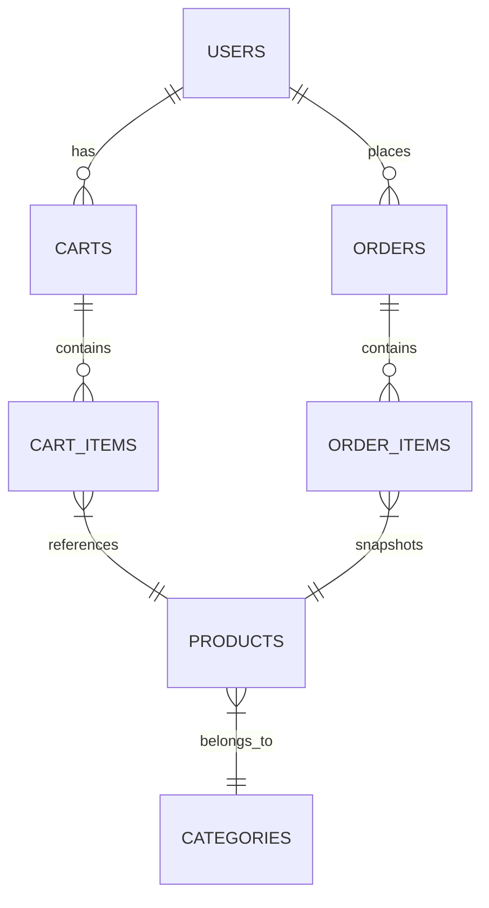

# Database Schema — Seventh Sky Store

#database #backend

---

## Entity Relationship Diagram



---

## Tables

### users
| Column | Type | Constraints | Description |
|--------|------|-------------|-------------|
| id | bigint | PK, Auto Increment | Primary key |
| name | varchar(255) | Not Null | User full name |
| email | varchar(255) | Unique, Not Null | Email address |
| email_verified_at | timestamp | Nullable | Verification timestamp |
| password | varchar(255) | Not Null | Bcrypt hashed |
| role | varchar(255) | Not Null, Default: 'customer' | 'customer' or 'admin' |
| remember_token | varchar(100) | Nullable | Remember me token |
| created_at | timestamp | | |
| updated_at | timestamp | | |

**Indexes:** `email` (unique)

---

### categories
| Column | Type | Constraints | Description |
|--------|------|-------------|-------------|
| id | bigint | PK, Auto Increment | Primary key |
| name | varchar(255) | Not Null | Category name |
| slug | varchar(255) | Unique, Not Null | URL-friendly slug |
| created_at | timestamp | | |
| updated_at | timestamp | | |

**Indexes:** `slug` (unique)

---

### products
| Column | Type | Constraints | Description |
|--------|------|-------------|-------------|
| id | bigint | PK, Auto Increment | Primary key |
| category_id | bigint | FK → categories.id, Not Null | Category reference |
| name | varchar(255) | Not Null | Product name |
| slug | varchar(255) | Unique, Not Null | URL-friendly slug |
| description | text | Nullable | Product description |
| sku | varchar(255) | Unique, Not Null | Stock Keeping Unit |
| price | decimal(12,2) | Not Null | Price in IDR |
| stock | integer | Not Null, Default: 0 | Available quantity |
| image | varchar(255) | Nullable | Cloudinary image URL |
| image_public_id | varchar(255) | Nullable | Cloudinary public ID |
| is_active | boolean | Not Null, Default: true | Visibility flag |
| created_at | timestamp | | |
| updated_at | timestamp | | |

**Indexes:** `slug` (unique), `sku` (unique), `category_id`, `is_active`

---

### carts
| Column | Type | Constraints | Description |
|--------|------|-------------|-------------|
| id | bigint | PK, Auto Increment | Primary key |
| user_id | bigint | FK → users.id, Unique, Not Null | One cart per user |
| created_at | timestamp | | |
| updated_at | timestamp | | |

**Indexes:** `user_id` (unique)

---

### cart_items
| Column | Type | Constraints | Description |
|--------|------|-------------|-------------|
| id | bigint | PK, Auto Increment | Primary key |
| cart_id | bigint | FK → carts.id, Not Null | Cart reference |
| product_id | bigint | FK → products.id, Not Null | Product reference |
| quantity | integer | Not Null, Default: 1 | Item quantity |
| created_at | timestamp | | |
| updated_at | timestamp | | |

**Indexes:** `cart_id`, `product_id`, `cart_id + product_id` (unique)

---

### orders
| Column | Type | Constraints | Description |
|--------|------|-------------|-------------|
| id | bigint | PK, Auto Increment | Primary key |
| user_id | bigint | FK → users.id, Not Null | Customer reference |
| order_number | varchar(255) | Unique, Not Null | Human-readable order ID |
| recipient_name | varchar(255) | Not Null | Shipping recipient |
| phone | varchar(255) | Not Null | Contact phone |
| address | text | Not Null | Street address |
| city | varchar(255) | Not Null | City |
| postal_code | varchar(20) | Not Null | Postal code |
| total_price | decimal(12,2) | Not Null | Subtotal (items only) |
| shipping_cost | decimal(12,2) | Not Null, Default: 0 | Shipping fee |
| grand_total | decimal(12,2) | Not Null | total_price + shipping_cost |
| payment_status | varchar(50) | Not Null, Default: 'pending' | pending/paid/failed/expired/refunded |
| order_status | varchar(50) | Not Null, Default: 'pending' | pending/processing/shipped/completed/cancelled |
| midtrans_order_id | varchar(255) | Nullable | Midtrans order ID |
| midtrans_token | varchar(255) | Nullable | Snap token |
| transaction_id | varchar(255) | Nullable | Midtrans transaction ID |
| payment_type | varchar(50) | Nullable | Payment method type |
| paid_at | timestamp | Nullable | Payment completion time |
| created_at | timestamp | | |
| updated_at | timestamp | | |

**Indexes:** `order_number` (unique), `user_id`, `payment_status`, `order_status`, `midtrans_order_id`

---

### order_items
| Column | Type | Constraints | Description |
|--------|------|-------------|-------------|
| id | bigint | PK, Auto Increment | Primary key |
| order_id | bigint | FK → orders.id, Not Null | Order reference |
| product_id | bigint | FK → products.id, Not Null | Product reference (snapshot) |
| product_name | varchar(255) | Not Null | Name at purchase time |
| product_price | decimal(12,2) | Not Null | Price at purchase time |
| quantity | integer | Not Null | Quantity purchased |
| subtotal | decimal(12,2) | Not Null | product_price * quantity |
| created_at | timestamp | | |
| updated_at | timestamp | | |

**Indexes:** `order_id`, `product_id`

---

### personal_access_tokens (Sanctum)
| Column | Type | Constraints | Description |
|--------|------|-------------|-------------|
| id | bigint | PK, Auto Increment | Primary key |
| tokenable_type | varchar(255) | Not Null | Model class |
| tokenable_id | bigint | Not Null | Model ID |
| name | varchar(255) | Not Null | Token name |
| token | varchar(64) | Unique, Not Null | Hashed token |
| abilities | text | Nullable | JSON array of abilities |
| last_used_at | timestamp | Nullable | Last usage |
| expires_at | timestamp | Nullable | Expiration |
| created_at | timestamp | | |
| updated_at | timestamp | | |

**Indexes:** `tokenable_type + tokenable_id`, `token` (unique)

---

### cache, jobs, failed_jobs
Standard Laravel tables for caching and queue workers.

---

## Migrations History

| File | Date | Description |
|------|------|-------------|
| `0001_01_01_000000_create_users_table.php` | Base | Users table |
| `0001_01_01_000001_create_cache_table.php` | Base | Cache table |
| `0001_01_01_000002_create_jobs_table.php` | Base | Jobs table |
| `2026_06_02_000003_create_personal_access_tokens_table.php` | 2026-06-02 | Sanctum tokens |
| `2026_06_02_000004_add_role_to_users_table.php` | 2026-06-02 | Role column |
| `2026_06_02_000005_create_categories_table.php` | 2026-06-02 | Categories |
| `2026_06_02_000006_create_carts_table.php` | 2026-06-02 | Carts |
| `2026_06_02_000007_create_products_table.php` | 2026-06-02 | Products |
| `2026_06_02_000008_create_orders_table.php` | 2026-06-02 | Orders |
| `2026_06_02_162538_create_cart_items_table.php` | 2026-06-02 | Cart items |
| `2026_06_02_162539_create_order_items_table.php` | 2026-06-02 | Order items |
| `2026_06_02_180704_add_unique_user_to_carts_table.php` | 2026-06-02 | Unique user on carts |
| `2026_06_02_180740_add_unique_cart_product_to_cart_items_table.php` | 2026-06-02 | Unique cart+product |
| `2026_06_03_023752_add_sku_to_products_table.php` | 2026-06-03 | SKU column |
| `2026_06_03_030409_add_cloudinary_fields_to_products_table.php` | 2026-06-03 | Cloudinary fields |
| `2026_06_03_032123_add_total_fields_to_orders_table.php` | 2026-06-03 | Shipping, grand_total |
| `2026_06_10_041926_add_payment_history_to_orders_table.php` | 2026-06-10 | Midtrans fields |

---

## Key Relationships

```php
// User
User::hasOne(Cart::class);
User::hasMany(Order::class);

// Cart
Cart::belongsTo(User::class);
Cart::hasMany(CartItem::class);

// CartItem
CartItem::belongsTo(Cart::class);
CartItem::belongsTo(Product::class);

// Product
Product::belongsTo(Category::class);
Product::hasMany(CartItem::class);
Product::hasMany(OrderItem::class);

// Category
Category::hasMany(Product::class);

// Order
Order::belongsTo(User::class);
Order::hasMany(OrderItem::class);

// OrderItem
OrderItem::belongsTo(Order::class);
OrderItem::belongsTo(Product::class); // snapshot
```

---

## Order State Machine

```
┌─────────┐
│ pending │──────► cancelled
└────┬────┘
     │
     ▼
┌───────────┐
│processing │──────► cancelled (if refund)
└────┬──────┘
     │
     ▼
┌────────┐
│ shipped│
└────┬───┘
     │
     ▼
┌──────────┐
│completed │
└──────────┘
```

**Rules:**
- `pending` → `processing` | `cancelled`
- `processing` → `shipped`
- `shipped` → `completed`
- `completed` → (terminal)
- `cancelled` → (terminal)
- Cannot transition to processing/shipped/completed if `payment_status !== 'paid'`

---

## Stock Management Logic

### On Checkout
```php
// CheckoutController@store
DB::transaction(function () {
    $order = Order::create([...]);
    
    foreach ($cartItems as $item) {
        OrderItem::create([...]);
        $item->product->decrement('stock', $item->quantity);
    }
    
    $cart->items()->delete(); // Clear cart
});
```

### On Payment Success (Webhook)
```php
// MidtransController@notification
if ($transactionStatus === 'settlement' || $transactionStatus === 'capture') {
    $order->update([
        'payment_status' => 'paid',
        'order_status' => 'processing',
        'paid_at' => now(),
    ]);
}
```

### On Payment Failure/Expiry
```php
if (in_array($transactionStatus, ['deny', 'cancel', 'expire'])) {
    $order->update(['payment_status' => $transactionStatus]);
    
    // Restore stock
    foreach ($order->items as $item) {
        $item->product->increment('stock', $item->quantity);
    }
}
```

---

## Related Notes

- [[Architecture]] — System architecture
- [[API Reference]] — Endpoints using these models
- [[Order Management]] — Order flow & state machine
- [[Backend Structure]] — Models & relationships